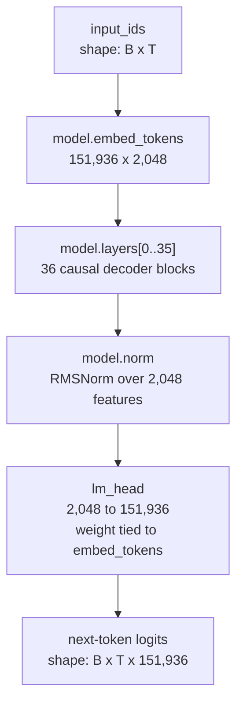
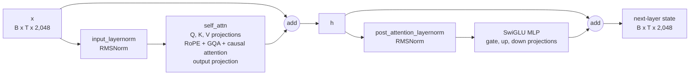

# Qwen2.5-Coder-3B-Instruct Architecture Map

This document maps the exact base checkpoint used by the lab to its learned
weight surfaces. Its purpose is to support an explicit LoRA target-module
decision; it is not a generic Transformer illustration and does not yet choose
which modules should receive adapters.

## Pinned model

- Checkpoint: `Qwen/Qwen2.5-Coder-3B-Instruct`
- Revision: `89fe5444e8baf5736e70f528f1edcc79e6616ef6`
- Hugging Face class: `Qwen2ForCausalLM`
- Local protocol: [`configs/model_input_protocols/qwen2_5_coder_3b_agentenv_json.yaml`](../../configs/model_input_protocols/qwen2_5_coder_3b_agentenv_json.yaml)
- Exact upstream configuration: [pinned `config.json`](https://huggingface.co/Qwen/Qwen2.5-Coder-3B-Instruct/blob/89fe5444e8baf5736e70f528f1edcc79e6616ef6/config.json)

The checkpoint is a dense, decoder-only causal language model. It is not a
mixture-of-experts model. “Coder” describes its training specialization, not a
separate code-only branch in the network.

## Why Mermaid

There is no single best model-architecture notation. For this repository, a
two-level Mermaid flowchart plus exact module tables is a useful combination:

- the flowcharts communicate topology and residual paths;
- the tables preserve exact names, dimensions, and parameter surfaces;
- the diagram remains reviewable text in Git rather than a hand-maintained
  image;
- GitHub renders Mermaid directly in Markdown.

The diagrams are explanatory. The pinned config and implementation are the
authoritative sources when a drawing and code disagree.

## Whole-model view



The equivalent module tree is readable even where Mermaid is not rendered:

```text
Qwen2ForCausalLM
├── model: Qwen2Model
│   ├── embed_tokens: Embedding(151,936, 2,048)
│   ├── layers[0..35]: 36 x Qwen2DecoderLayer
│   │   ├── input_layernorm: RMSNorm(2,048)
│   │   ├── self_attn
│   │   │   ├── q_proj: Linear(2,048 -> 2,048, bias=True)
│   │   │   ├── k_proj: Linear(2,048 -> 256, bias=True)
│   │   │   ├── v_proj: Linear(2,048 -> 256, bias=True)
│   │   │   └── o_proj: Linear(2,048 -> 2,048, bias=False)
│   │   ├── post_attention_layernorm: RMSNorm(2,048)
│   │   └── mlp
│   │       ├── gate_proj: Linear(2,048 -> 11,008, bias=False)
│   │       ├── up_proj: Linear(2,048 -> 11,008, bias=False)
│   │       └── down_proj: Linear(11,008 -> 2,048, bias=False)
│   └── norm: RMSNorm(2,048)
└── lm_head: Linear(2,048 -> 151,936, bias=False)
    └── weight is tied to model.embed_tokens.weight
```

## One decoder block

Qwen2 uses pre-normalization: each sublayer sees a normalized input, while its
output is added back to the unnormalized residual stream.



In plain operations:

```text
h = x + self_attention(input_layernorm(x))
y = h + down_proj(silu(gate_proj(post_attention_layernorm(h)))
                  * up_proj(post_attention_layernorm(h)))
```

The repeated normalization expression above describes the data dependency; an
implementation computes that normalized MLP input once.

### Grouped-query attention

Each token is projected into:

```text
Q: 16 heads x 128 features = 2,048 features
K:  2 heads x 128 features =   256 features
V:  2 heads x 128 features =   256 features
```

RoPE is applied to queries and keys. Each key/value head is then shared by
eight query heads because `16 / 2 = 8`. Causal attention combines values, the
16 query-head outputs are concatenated back to 2,048 features, and `o_proj`
maps the result into the residual stream.

This asymmetry matters for LoRA: `k_proj` and `v_proj` are much smaller matrices
than `q_proj` and `o_proj`, even though all four names occur once per layer.
RoPE, causal masking, softmax, and key/value-head repetition have no learned
weight matrix to target.

### Gated MLP

The MLP has two parallel input projections and one output projection:

```text
gate = silu(gate_proj(x_norm))       # 2,048 -> 11,008
up   = up_proj(x_norm)               # 2,048 -> 11,008
mlp  = down_proj(gate * up)          # 11,008 -> 2,048
```

The elementwise gate is the SwiGLU-style feed-forward path used by Qwen2. It is
not a mixture-of-experts router.

## Exact checkpoint dimensions

| Configuration field | Pinned value | Architectural meaning |
| --- | ---: | --- |
| `hidden_size` | 2,048 | Residual-stream width |
| `num_hidden_layers` | 36 | Repeated decoder blocks |
| `num_attention_heads` | 16 | Query heads |
| `num_key_value_heads` | 2 | Shared key/value heads |
| derived head width | 128 | `2,048 / 16` |
| `intermediate_size` | 11,008 | Gated-MLP width |
| `vocab_size` | 151,936 | Checkpoint embedding/output rows |
| `max_position_embeddings` | 32,768 | Configured context extent |
| `rope_theta` | 1,000,000 | RoPE base |
| `rms_norm_eps` | `1e-6` | RMSNorm stability constant |
| `attention_dropout` | 0.0 | Attention dropout probability |
| `tie_word_embeddings` | `true` | Input embedding and LM head share a weight |
| `use_sliding_window` | `false` | This checkpoint uses full causal attention |
| `torch_dtype` | `bfloat16` | Checkpoint-declared weight dtype |

The technical report describes a vocabulary of 151,646 tokens, while this
checkpoint allocates 151,936 embedding rows. For adapter sizing and actual
loading, the pinned checkpoint config is authoritative; the larger effective
embedding size is a model-storage detail rather than evidence of 290 additional
ordinary tokenizer entries.

## Learned weight surfaces

PyTorch linear weights are stored as `[out_features, in_features]`. `{i}` below
ranges from 0 through 35.

| Surface | Exact module path | Weight shape per layer | Bias |
| --- | --- | ---: | ---: |
| Query projection | `model.layers.{i}.self_attn.q_proj` | `[2,048, 2,048]` | `[2,048]` |
| Key projection | `model.layers.{i}.self_attn.k_proj` | `[256, 2,048]` | `[256]` |
| Value projection | `model.layers.{i}.self_attn.v_proj` | `[256, 2,048]` | `[256]` |
| Attention output | `model.layers.{i}.self_attn.o_proj` | `[2,048, 2,048]` | none |
| MLP gate | `model.layers.{i}.mlp.gate_proj` | `[11,008, 2,048]` | none |
| MLP up | `model.layers.{i}.mlp.up_proj` | `[11,008, 2,048]` | none |
| MLP down | `model.layers.{i}.mlp.down_proj` | `[2,048, 11,008]` | none |
| Attention pre-norm | `model.layers.{i}.input_layernorm` | `[2,048]` | none |
| MLP pre-norm | `model.layers.{i}.post_attention_layernorm` | `[2,048]` | none |

Outside the repeated blocks:

| Surface | Exact module path | Weight shape | Relationship |
| --- | --- | ---: | --- |
| Token embedding | `model.embed_tokens` | `[151,936, 2,048]` | Shared parameter |
| Final norm | `model.norm` | `[2,048]` | Independent RMSNorm weight |
| Vocabulary head | `lm_head` | `[151,936, 2,048]` | Tied to `model.embed_tokens.weight` |

The tied embedding/head appears as two logical uses but represents one distinct
base parameter. It must not be counted or reasoned about as two independently
modifiable matrices.

## Where the base parameters live

These counts are derived from the pinned config and the pinned Qwen2 module
definitions. Tied weights are counted once.

| Component group | Distinct parameters | Approximate share |
| --- | ---: | ---: |
| Tied token embedding / LM head | 311,164,928 | 10.08% |
| Attention projections and QKV biases, all 36 layers | 339,830,784 | 11.01% |
| Gated-MLP projections, all 36 layers | 2,434,793,472 | 78.90% |
| All RMSNorm weights | 149,504 | <0.01% |
| **Total** | **3,085,938,688** | **100%** |

The model is called “3B” because it has about 3.09 billion distinct parameters.
Most of those parameters live in the MLP projections, not in attention.

## LoRA target inventory, without choosing a policy

For a linear weight with input width `d_in`, output width `d_out`, and LoRA rank
`r`, ordinary LoRA adds:

```text
adapter_parameters = r * (d_in + d_out)
```

The following table assumes the same rank on every matching module in all 36
layers. It counts adapter matrices only; ordinary LoRA leaves the base weights
and biases frozen.

| Target suffix | Instances | Adapter parameters across all layers |
| --- | ---: | ---: |
| `q_proj` | 36 | `147,456 * r` |
| `k_proj` | 36 | `82,944 * r` |
| `v_proj` | 36 | `82,944 * r` |
| `o_proj` | 36 | `147,456 * r` |
| `gate_proj` | 36 | `470,016 * r` |
| `up_proj` | 36 | `470,016 * r` |
| `down_proj` | 36 | `470,016 * r` |
| **All four attention projections** | **144** | **`460,800 * r`** |
| **All three MLP projections** | **108** | **`1,410,048 * r`** |
| **All seven projections** | **252** | **`1,870,848 * r`** |

For orientation at rank 8:

```text
all attention projections:  3,686,400 trainable adapter parameters
all MLP projections:       11,280,384 trainable adapter parameters
all seven projections:     14,966,784 trainable adapter parameters
```

These counts make module targeting an explicit modeling choice rather than a
string-list convention. The next decision should state what adaptation
hypothesis the smoke test is meant to test, then choose among narrower
attention-only and broader attention-plus-MLP surfaces under that hypothesis.

## Sources

- [Pinned Qwen2.5-Coder-3B-Instruct configuration](https://huggingface.co/Qwen/Qwen2.5-Coder-3B-Instruct/blob/89fe5444e8baf5736e70f528f1edcc79e6616ef6/config.json)
- [Qwen2.5-Coder technical report](https://arxiv.org/html/2409.12186)
- [Qwen2 technical report: dense-model architecture](https://arxiv.org/html/2407.10671#S2.SS2.SSS1)
- [Transformers 4.43.1 Qwen2 implementation](https://github.com/huggingface/transformers/blob/v4.43.1/src/transformers/models/qwen2/modeling_qwen2.py)
- [GitHub documentation for Mermaid diagrams](https://docs.github.com/en/get-started/writing-on-github/working-with-advanced-formatting/creating-diagrams)
- [Mermaid flowchart syntax](https://mermaid.js.org/syntax/flowchart.html)
