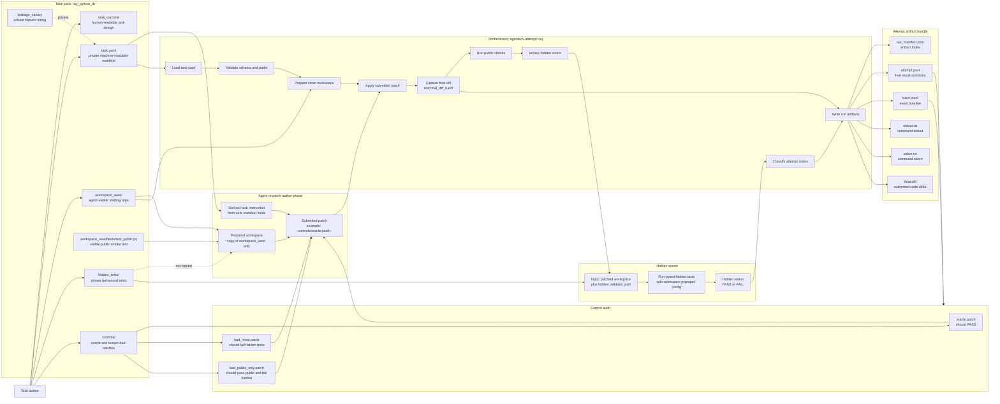

# Week 1 Learnings

## Main Mental Model

This week I learned that a coding-agent eval is not just "run tests after an agent writes code."

The better mental model is:

```text
task design -> agent-visible workspace -> submitted artifact -> orchestrator -> scorer -> artifacts -> audit
```

Each part has a different job. When I mix those jobs together, the system becomes harder to understand and easier to accidentally leak private information.

## Simple Eval Framework Diagram

```mermaid
flowchart LR
    task[Task pack<br/>instructions, seed repo, tests, controls]
    visible[Agent-visible workspace<br/>safe subset of task]
    submission[Submitted patch]
    orchestrator[Orchestrator<br/>sets up and runs attempt]
    public[Public checks<br/>visible smoke tests]
    scorer[Hidden scorer<br/>private behavior tests]
    result[Attempt result<br/>PASS or failure status]
    artifacts[Artifacts<br/>trace, stdout, stderr, final.diff]

    task --> visible
    visible --> submission
    task --> orchestrator
    submission --> orchestrator
    orchestrator --> public
    public --> scorer
    scorer --> result
    orchestrator --> artifacts
    result --> artifacts
```



The simple version is: I define a task, give the agent only the safe visible workspace, receive a patch, let the orchestrator run the lifecycle, let the scorer check private behavior, and save artifacts so I can audit what happened.

## Detailed Eval Framework Diagram



## How To Read The Diagram

The task pack contains more than the agent should see. This was the most important boundary for me to understand.

The agent-visible part is only:

- the task instruction,
- the copied `workspace_seed/`,
- the public tests if I choose to expose them.

The private eval-side part is:

- `task.yaml`,
- `hidden_tests/`,
- `controls/`,
- `leakage_canary`,
- scoring and replay expectations.

The orchestrator sees private eval-side information because it is the evaluation harness. The agent should not receive the full manifest.

## What I Learned From The References

### Inspect AI

The useful idea from Inspect AI is separation:

```text
task -> solver/agent -> scorer
```

My local version is not exactly Inspect, but the separation helped me stop thinking of this as one giant script. In my repo:

- `tasks/` loads and validates task definitions,
- `envs/` prepares the agent-visible workspace,
- `runners/` execute commands or apply patches,
- `scorers/` run hidden validators,
- `orchestrators/` coordinate a full attempt and write artifacts.

### Terminal-Bench / Harbor

The useful idea from Terminal-Bench-style tasks is directory discipline:

```text
instruction + environment + verifier + solution + metadata
```

My local mapping is:

```text
task_card.md
task.yaml
workspace_seed/
hidden_tests/
controls/
```

This made it easier to ask: "Which files are part of the task definition, which files are visible to the agent, and which files are private to scoring?"

### METR Task Standard

The useful idea from METR-style task design is that controls test the measurement setup.

Controls are not agent attempts. They are calibration cases:

- `oracle.patch` proves the harness can accept a correct solution.
- `bad_noop.patch` proves doing nothing is rejected by hidden behavior checks.
- `bad_public_only.patch` proves passing public tests is not enough.

This helped me understand that controls are tests of my eval framework.

### SWE-bench

The useful idea from SWE-bench is the patch-evaluation contract:

```text
instance id + patch -> apply patch -> run tests -> record result
```

That gave this Week 1 task a concrete submitted artifact: a patch file. The scorer is not judging a conversation. It is judging the behavior of a patched workspace.

## Most Important Boundaries

### Task Manifest Is Not Agent Input

`task.yaml` is framework config. It contains private paths and eval metadata, so the full manifest should not be sent to the agent.

If I want the agent to see task instructions, I should derive a safe view from the manifest and task card.

### Public Tests Are Smoke Tests

The public test is intentionally weak:

```text
normalize_ratio(6, 3) == 2.0
```

That public check proves the project can run. It does not prove the implementation is correct.

The hidden tests define the real behavioral contract.

### Hidden Tests Must Not Leak

The hidden tests are outside `workspace_seed/`.

The prepared workspace should not contain:

```text
hidden_tests/
```

The scorer now runs hidden tests from the task pack against the patched workspace, instead of copying hidden tests into the submitted workspace. This keeps the submitted workspace cleaner and makes `final.diff` easier to interpret.

### Orchestrator Is Not The Same As Scorer

The orchestrator coordinates lifecycle:

```text
load manifest
prepare workspace
apply patch
run public checks
invoke scorer
write artifacts
```

The scorer answers the narrower behavioral question:

```text
does this patched workspace pass the hidden validator?
```

This distinction made the architecture clearer.

## Attempt Statuses

The attempt result should not collapse everything into `FAIL`.

Current important statuses:

- `PASS`: patch applied, public checks passed, hidden checks passed.
- `PATCH_APPLY_ERROR`: the submitted patch could not be applied.
- `PUBLIC_TEST_FAIL`: public checks failed, so hidden scoring was not run.
- `HIDDEN_TEST_FAIL`: public checks passed, but hidden validation failed.
- `TIMEOUT`: a command exceeded the timeout.
- `ORCHESTRATOR_ERROR`: lifecycle failure in the eval harness.
- `SCORER_ERROR`: failure inside scoring infrastructure.

This is useful because each failure type points to a different debugging path.

## What The Artifacts Mean

Each run writes an attempt artifact bundle:

```text
run_manifest.json
attempt.json
trace.jsonl
stdout.txt
stderr.txt
final.diff
```

My current interpretation:

- `run_manifest.json` is the index for the run directory.
- `attempt.json` is the final summary.
- `trace.jsonl` is the timeline of what happened.
- `stdout.txt` and `stderr.txt` are raw command evidence.
- `final.diff` is the code delta between `workspace_seed/` and the patched workspace.

The key idea is that a score without evidence is hard to debug. The artifacts make the score auditable.

## Concrete Week 1 Calibration

The current task is `toy_python_fix_001`.

The intended behavior is:

- `oracle.patch` should pass public and hidden checks.
- `bad_noop.patch` should pass public checks but fail hidden checks.
- `bad_public_only.patch` should pass public checks but fail hidden checks.

This teaches the core lesson:

```text
public pass != task pass
```

It also teaches that the framework itself needs tests. If my oracle fails, my scorer or task may be wrong. If my bad controls pass, my hidden tests are too weak.

## What Still Feels Important To Remember

This Week 1 framework is a learning harness, not a secure sandbox.

The goal is not to claim broad agent capability. The goal is to learn the minimum mechanics of a trustworthy local eval loop:

- clear task definition,
- explicit visibility boundaries,
- private scoring,
- known-good and known-bad controls,
- structured attempt results,
- enough traces to debug failures.

Only after one tiny task is understandable should I add more tasks.
