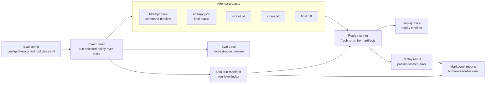

# Week 2 Learnings

## Main Mental Model

Week 1 built one attempt:

```text
task manifest + submitted patch -> attempt orchestrator -> public checks -> hidden scorer -> attempt artifacts
```

Week 2 moved one level up:

```text
eval config -> eval runner -> many attempts -> eval artifacts -> replay -> reports
```

The important shift is from "can I score one patch?" to "can I repeatedly run a
named policy over a task set, preserve enough evidence, and later reproduce the
result?"

## System Shape



The eval run is now the primary unit of measurement. Attempts are nested
evidence inside that run. Replay and reporting consume artifacts instead of
re-running ad hoc commands.

## Eval Orchestration

The eval runner is not an agent and not a scorer. It is the run-level
orchestrator.

Its job is to:

- load one eval config,
- select one named policy,
- resolve the requested task set,
- run the attempt path for each task and attempt index,
- write a run-level manifest,
- write a run-level trace.

The current eval config is:

```text
configs/eval/control_policies.yaml
```

The current policies are calibration controls:

```text
oracle
bad-noop
bad-public-only
```

These policies do not measure model capability. They test whether the harness
can accept a known-good patch and reject known-bad patches.

## Artifact Boundaries

Eval artifacts live under:

```text
experiments/runs/<eval_run_name>/
```

The top-level eval run contains:

```text
run_manifest.json
trace.jsonl
attempts/
```

Each nested attempt still contains the Week 1 attempt bundle:

```text
attempt.json
run_manifest.json
stdout.txt
stderr.txt
trace.jsonl
final.diff
```

This matters because there are now two different levels of truth:

- eval-level artifacts explain which tasks and policies were run,
- attempt-level artifacts explain what happened inside one patch attempt.

The run-level report is a convenience view. The source of truth remains the JSON
artifacts and traces.

## Trace Levels

Week 2 made traces more explicit.

There are now three trace families:

```text
eval trace
attempt trace
replay trace
```

They answer different questions.

### Eval Trace

The eval trace answers:

```text
What did the eval orchestrator schedule and complete?
```

Current eval events:

```text
eval_started
eval_task_started
eval_attempt_started
eval_attempt_finished
eval_task_finished
eval_finished
```

Eval traces carry provenance such as:

```text
eval_run_id
config_hash
config_name
policy
task_id
task_index
attempt_index
attempt_id
```

### Attempt Trace

The attempt trace answers:

```text
What commands did one attempt run, and what status did it produce?
```

Current attempt events:

```text
attempt_started
command_finished
attempt_finished
```

This is where command-level stdout/stderr refs, return codes, and final diff
hashes belong.

### Replay Trace

The replay trace answers:

```text
How did replay load a previous eval run, rerun attempts, and compare results?
```

Current replay events include loading the source manifest, loading source
attempts, running fresh attempts, recording comparisons, and finishing or
failing replay.

## Replay

Replay consumes an eval run artifact directory, not an eval config.

That design choice matters. Replay should answer:

```text
Given the saved eval artifacts, can I reproduce the relevant attempt outcomes?
```

Replay compares these stable fields:

```text
status
public_status
hidden_status
error_class
final_diff_hash
```

Top-level replay statuses are:

```text
PASS
MISMATCH
REPLAY_ERROR
```

`replay_results.jsonl` is the per-attempt comparison table. It is not the
process trace. The process trace is `trace.jsonl`.

Replay also writes fresh attempt artifacts, so a mismatch can be inspected by
comparing source and replay attempt directories.

## Reporting

Reports are generated from artifact directories.

Eval reports live under:

```text
experiments/reports/evals/
```

Replay reports live under:

```text
experiments/reports/replays/
```

The report command dispatches based on artifact version. This keeps the CLI
simple and makes reports a derived view over persisted evidence.

Reports are useful for quick inspection, but they should not become the only
thing I inspect. If a result is surprising, I should go back to manifests,
traces, attempt JSON, stdout/stderr, and diffs.

## Schema Discipline

Week 2 added explicit trace validation:

```text
src/agentenv/tracing/schema.py
src/agentenv/tracing/validate.py
```

Important schema choices:

- `event_type` is enumerated, not free-form.
- `provenance_config` is typed by event family.
- payloads remain flexible for now.

This is the right amount of strictness for the current system. Event names and
provenance are identity-bearing fields, so typos there would damage auditability.
Payloads can stay flexible until a real debugging need forces more structure.

## What Week 2 Proves

Week 2 proves that this lab can:

- run a named control policy from config,
- persist eval-level and attempt-level artifacts,
- distinguish oracle from known-bad controls,
- replay an eval run from saved artifacts,
- generate reports from artifacts,
- validate structured traces across eval, attempt, and replay layers.

This is enough infrastructure to start evaluating eval quality.

## What Week 2 Does Not Prove

Week 2 does not prove:

- any model can solve the task,
- any training method improves behavior,
- the task suite is broad or robust,
- hidden validators are hard to game,
- replay catches all nondeterminism,
- trace artifacts are safe for training or sharing,
- the system is sandbox-secure.

The current task suite still has one toy task. The control policies are
calibration cases, not agent results. Passing replay means the saved run was
reproducible under the compared fields, not that the eval is meaningful.

## Self-Deception Traps

The main traps after Week 2 are:

- mistaking infrastructure completeness for eval quality,
- overfitting to one toy task,
- treating reports as evidence instead of summaries,
- treating trace refs as a security boundary,
- adding more schema polish before adding meaningful task/failure coverage,
- claiming model or post-training progress before any model enters the loop.

## Week 2 Closure

Week 2 should stop here.

The next useful work is not more eval-run plumbing. It is to increase eval
quality:

- add a small number of additional tasks,
- add more meaningful failure modes,
- check whether public-only and other bad controls are reliably caught,
- use reports and traces for failure analysis,
- document limitations before adding agents or training.
