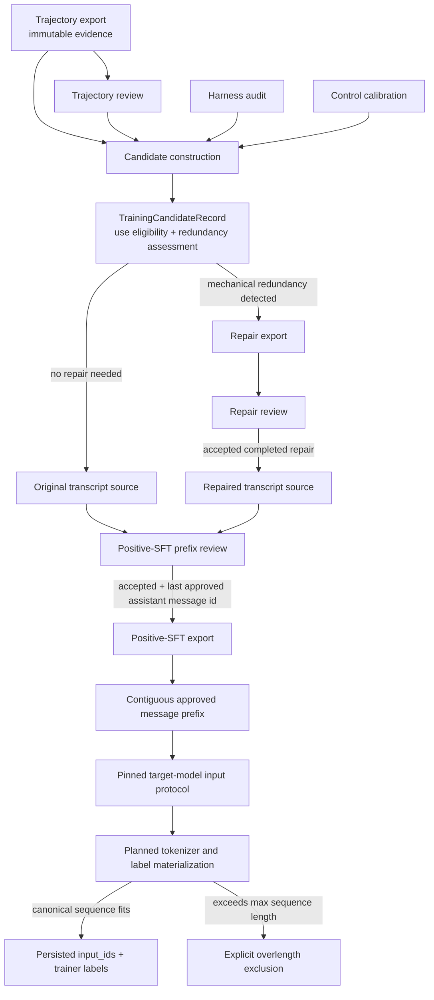

# Training-data workflow

This package owns the decisions and transformations that turn trusted trajectory
evidence into objective-specific training records. It does not own eval execution
or the immutable trajectory evidence itself.

## Package ownership

- `candidates/` validates the trajectory-review, harness-audit, and control-
  calibration gates and emits `TrainingCandidateRecord` objects. Candidate
  eligibility describes allowed downstream uses; it does not claim that every
  allowed use is automatically good training data.
- `repairs/` detects mechanical redundancy, performs source-preserving transcript
  repair, exports repair records, and runs a separate repair review. A repair is
  an optional transformation of a candidate source, never a mutation of the
  source trajectory.
- `positive_sft/` selects an exact original or accepted repaired source, runs the
  objective-specific prefix review, and exports approved positive-SFT prefixes.
  It owns positive-SFT semantics rather than generic “SFT” semantics.

Shared validation of the trajectory and review artifacts pinned by a candidate
lives in `candidates/source_integrity.py`. Positive-SFT source choice and repair
provenance live in `positive_sft/source_selection.py`. This keeps source
validation upstream of the objective-specific builder; repair code does not
depend on a training objective.

## Flow



Clean candidates bypass repair. Candidates with a selected repair must pin both
the repair record and its accepted repair-review record. Repair review answers
“was this transformation valid?” Positive-SFT review answers “which assistant
prefix is desirable to imitate?” These are different judgments and neither can
stand in for the other.

## Core invariants

1. A `TrajectoryRecord` is never rewritten to make it trainable.
2. Candidate construction is blocked when its pinned harness or control evidence
   is missing, failed, or has drifted.
3. Task success is not required for positive-SFT review. A failed task may contain
   a useful prefix; a successful task may still contain behavior that should not
   receive positive supervision.
4. Positive-SFT export requires an accepted objective-specific review and
   materializes the prefix ending at `last_approved_assistant_message_id`.
   The rejected suffix is omitted, not merely loss-masked while remaining in
   context.
5. Repaired sources are usable only when the repair completed, the repair review
   accepted it, and all source records and artifact bytes remain hash-pinned.
6. Message IDs identify occurrences, not content. Retained messages preserve
   their IDs through deletion-only repair, allowing review boundaries to remain
   auditable.
7. The target-model input protocol pins the checkpoint, tokenizer artifacts,
   exact chat-template bytes, serialization operations, message projection, and
   tool representation. Token-level loss assignment remains downstream. System,
   user, and tool-observation tokens are context only; approved
   assistant-generated spans receive loss.
8. The initial materializer uses one trajectory-aggregated sequence per source
   example. An overlength sequence is explicitly excluded whole; it is not
   truncated, arbitrarily chunked, overlapped, or summarized.

## What an exported positive-SFT record means

An exported record means that the harness evidence was trusted, the candidate
was allowed to enter positive-SFT review, the exact original or repaired source
was pinned, and a human accepted a contiguous assistant-action prefix. It does
not mean the whole task succeeded, the full original trajectory was optimal, or
the record is already a tokenizer-ready trainer batch.

## Next boundary: canonical tokenization and labels

The next positive-SFT artifact will be a model-specific derivative of the
source export:

```text
PositiveSFTExampleRecord
-> pinned target-model input protocol
-> target checkpoint's compatible tokenizer
-> one trajectory-aggregated input_ids sequence
-> labels equal input_ids on approved assistant spans
-> labels equal -100 on system, user, and tool-observation spans
```

Canonical training tokens need not equal the exact ids emitted during the
original rollout. They must instead be reproducible for the target training
checkpoint and match the interface intended at deployment. Examples exceeding
the configured maximum sequence length remain explicit exclusions so dataset
coverage is not overstated.

The first protocol record is
`configs/model_input_protocols/qwen2_5_coder_3b_agentenv_json.yaml`. It applies
the exact pinned upstream Qwen template for generation and completed-transcript
serialization. It projects only message `role` and `content`, retains the
AgentEnv content-level JSON action protocol, and does not authorize
provider-native tool serialization.
