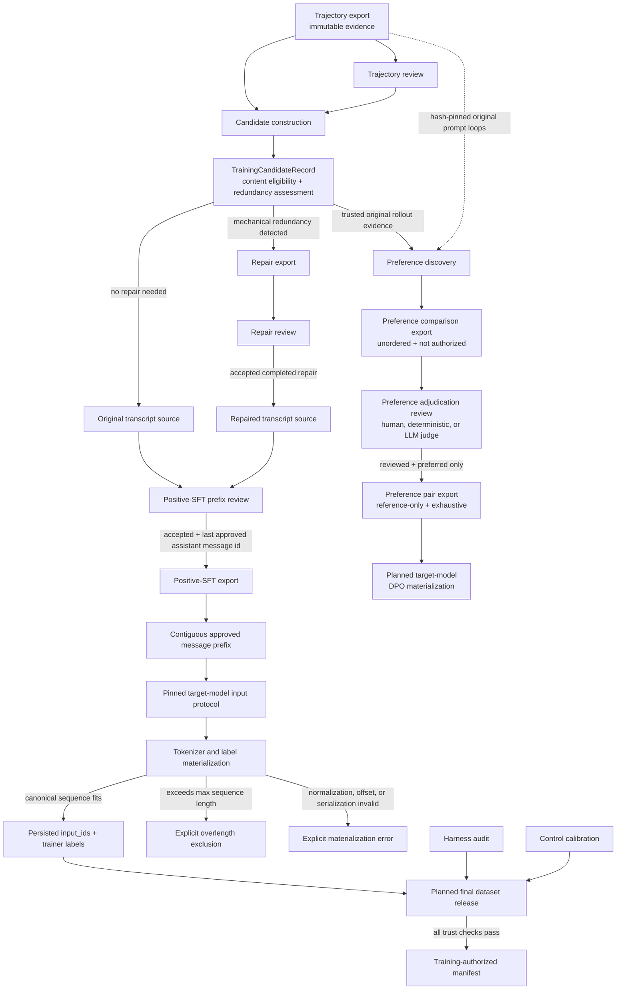

# Training-data workflow

This package owns the decisions and transformations that turn validated trajectory
and review evidence into objective-specific, pre-release data artifacts. It does
not own eval execution or the immutable trajectory evidence itself, and no artifact
before a final release manifest is authorized for training.

## Package ownership

- `candidates/` validates pinned trajectory and review evidence and emits
  `TrainingCandidateRecord` objects. `content_eligibility` describes which
  objective-specific construction workflows may inspect a candidate; it is not
  training authorization.
- `repairs/` detects mechanical redundancy, performs source-preserving transcript
  repair, exports repair records, and runs a separate repair review. A repair is
  an optional transformation of a candidate source, never a mutation of the
  source trajectory.
- `positive_sft/` selects an exact original or accepted repaired source, runs the
  objective-specific prefix review, exports approved positive-SFT prefixes, and
  owns their target-model materialization contract. It owns positive-SFT
  semantics rather than generic “SFT” semantics.
- `preferences/` mines original rollout evidence for distinct assistant actions
  under an exact shared decision state, persists unordered comparison exports,
  and owns the separate adjudication-review artifact that may label a
  comparison. It never treats a repaired transcript as an executed rollout.
- `release/` owns fail-closed harness-audit and control-calibration validation for
  the eventual final dataset release. The release manifest itself remains a
  downstream boundary after token materialization.

Shared validation of the trajectory and review artifacts pinned by a candidate
lives in `candidates/source_integrity.py`. Positive-SFT source choice and repair
provenance live in `positive_sft/source_selection.py`. This keeps source
validation upstream of the objective-specific builder; repair code does not
depend on a training objective.

## Flow



Clean candidates bypass repair. Candidates with a selected repair must pin both
the repair record and its accepted repair-review record. Repair review answers
“was this transformation valid?” Positive-SFT review answers “which assistant
prefix is desirable to imitate?” These are different judgments and neither can
stand in for the other.

## Core invariants

1. A `TrajectoryRecord` is never rewritten to make it trainable.
2. Candidate construction and objective-specific review may proceed without a
   current calibration artifact, but their manifests are explicitly
   `not_authorized`. Only final dataset release may combine materialized examples
   with matching harness and control evidence and authorize trainer consumption.
3. Task success is not required for positive-SFT review. A failed task may contain
   a useful prefix; a successful task may still contain behavior that should not
   receive positive supervision.
4. Positive-SFT export requires an accepted objective-specific review and
   materializes the prefix ending at `last_approved_assistant_message_id`.
   The rejected suffix is omitted, not merely loss-masked while remaining in
   context.
5. Repaired sources are usable only when the repair completed, the repair review
   accepted it, and all source records and artifact bytes remain hash-pinned.
6. Message IDs identify occurrences, not content. Retained messages preserve
   their IDs through deletion-only repair, allowing review boundaries to remain
   auditable.
7. The target-model input protocol pins the checkpoint, tokenizer artifacts,
   exact chat-template bytes, serialization operations, message projection, and
   tool representation. It also pins a generation-ownership annotation whose
   render must remain byte-identical to the canonical template. The downstream
   positive-SFT materializer performs token-level loss assignment: system, user,
   and tool-observation tokens are context only, while approved
   assistant-generated spans receive loss.
8. The initial materializer uses one trajectory-aggregated sequence per source
   example. An overlength sequence is explicitly excluded whole; it is not
   truncated, arbitrarily chunked, overlapped, or summarized.
9. Every accepted source example must produce exactly one materialization result.
   Completed and failed outcomes are both persisted so exclusions and runtime
   failures cannot silently disappear from dataset accounting.
10. Preference discovery is gated by evidence integrity, not task success or
    trajectory-level behavioral acceptance. It may mine trusted unsuccessful,
    redundant, malformed, or reward-hacking behavior as a possible rejected
    alternative. Private leakage, ineligible splits, orchestration failures,
    incomplete reward-hack evaluation, and missing source evidence still block it.
11. Preference discovery only follows original prompt-loop artifacts. A repaired
    transcript is a dataset transformation, not an executed counterfactual rollout.
12. Preference discovery never chooses a direction. A hash-pinned adjudication
    may return `preferred`, `tie`, `ambiguous`, or `invalid`; only `preferred`
    names one of the two source alternative ids and can feed later pair export.
    Every reviewed result has a nonempty reason, a UTC timestamp, one pinned
    overall-preference rubric, and reviewer-type-specific provenance.
13. The comparison export is deterministically rebuilt from its pinned
    `TrainingCandidateExport` on load. The adjudication artifact separately pins
    that exact comparison manifest and payload plus an artifact-local copy of
    the rubric. Both remain `not_authorized`; review does not itself emit a DPO
    pair.
14. Pair export includes every validated `reviewed + preferred` adjudication and
    no other decision. It stores only hash-pinned source-record references;
    shared context and alternative content stay in upstream artifacts. Sampling
    and per-context weighting are later policies, not hidden export filters.

## What an exported positive-SFT record means

An exported record means that content checks allowed the candidate to enter
positive-SFT review, the exact original or repaired source was pinned, and a
human accepted a contiguous assistant-action prefix. It does not mean that the
harness has been calibrated, the whole task succeeded, the full original
trajectory was optimal, or the record is authorized for training. Candidate and
positive-SFT export manifests both state `training_authorization: not_authorized`.

## Canonical tokenization and labels

The positive-SFT training materialization artifact is a model-specific
derivative of the source export:

```text
PositiveSFTExampleRecord
-> pinned target-model input protocol
-> target checkpoint's compatible tokenizer
-> one trajectory-aggregated input_ids sequence
-> labels equal input_ids on approved assistant spans
-> labels equal -100 on system, user, and tool-observation spans
```

Canonical training tokens need not equal the exact ids emitted during the
original rollout. They must instead be reproducible for the target training
checkpoint and match the interface intended at deployment. Examples exceeding
the configured maximum sequence length remain explicit exclusions so dataset
coverage is not overstated.

The materializer renders the complete approved prefix once, rejects any
tokenizer normalization that changes those rendered bytes, tokenizes once with
offset mappings, and derives labels from the pinned model-generation spans. A
token wholly inside a model-owned span receives its input id as its label; a
token wholly outside receives `-100`; an ownership-boundary crossing, uncovered
source character, or decode mismatch is an explicit materialization error.

Every source row produces exactly one completed or failed result in source
order. The materialization manifest pins the source positive-SFT export, model
input protocol, sequence policy, materializer code, result counts, and JSONL
hash. Loading verifies exact source id/record-hash coverage and rebuilds the
tokens and labels from the pinned inputs before accepting the artifact.

A completed materialization is trainer-shaped, not training-authorized. It
means that the pinned source and target-model protocol deterministically
produced a valid, in-budget `input_ids` and `labels` sequence. It does not mean
that final harness and control evidence is current, that the example should be
sampled by a trainer, or that training is permitted. Failed materializations
remain accounting evidence and can never be passed to a trainer as examples.

The CLI entrypoint is:

```text
agentenv training positive-sft materialize \
  --source <positive-sft-export> \
  --model-input-protocol <protocol.yaml> \
  --max-sequence-length <tokens> \
  --out <materialization-artifact>
```

After token materialization, a separate final release manifest will pin the
materialized artifact plus matching harness-audit and control-calibration
artifacts. Trainer entrypoints must accept that release manifest rather than a
candidate, review, positive-SFT source export, or bare token JSONL.

The first protocol record is
`configs/model_input_protocols/qwen2_5_coder_3b_agentenv_json.yaml`. It applies
the exact pinned upstream Qwen template for generation and completed-transcript
serialization. It projects only message `role` and `content`, retains the
AgentEnv content-level JSON action protocol, and does not authorize
provider-native tool serialization. A separately hash-pinned annotated template
adds non-rendering Jinja generation blocks. Every ownership-aware render is
compared with the canonical render byte for byte before its model-generated
Python Unicode-string spans are accepted.

The Qwen2.5-Coder-3B Ollama runtime consumes this same record before every
generation. AgentEnv renders the full generation prompt and sends it through
Ollama's native generate endpoint with raw templating mode mandatory. The
OpenAI-compatible client remains a separate provider-owned serialization path;
the 7B and 14B Qwen2.5 configs remain on that path until they have their own
pinned input-protocol records.

## Preference discovery boundary

`PreferenceComparisonCandidateRecord` is an unlabeled action comparison, not a
DPO pair. Discovery scans every assistant decision occurrence in every
`preference_discovery_eligible` candidate and joins occurrences only when they
share all of:

```text
task hashes
harness runtime hash
ordered logical-message hashes through context C
canonical workspace hash immediately before the assistant action
```

Occurrence-only message IDs and assistant model names are provenance rather than
logical context content. Tool observations retain their tool name and call ID.
The complete original prompt-loop artifact and trajectory remain hash-pinned for
each occurrence.

Repeated observations of the same exact assistant content under one context are
aggregated as rollout evidence for one alternative. Distinct action hashes form
canonical unordered comparisons. If one context has `k` distinct actions, it can
therefore yield up to `k * (k - 1) / 2` comparison candidates. Pair count must not
be confused with independent context diversity.

Discovery does not inspect task success and contains no `chosen`, `rejected`, or
preference decision. `PreferenceAdjudicationRecord` is the separate decision
boundary. It lets a human, deterministic auditor, or pinned LLM judge return:

```text
preferred -> one exact source alternative is better under the pinned rubric
tie       -> the comparison is valid and the alternatives are confidently equivalent
ambiguous -> the comparison is valid but the evidence cannot support a direction
invalid   -> the comparison contract or its evidence is broken
```

Only `preferred` carries `preferred_alternative_id`; every other result is
non-directional. Pending-record construction pins the complete comparison
candidate hash and both alternative ids. Cross-record validation requires
exactly one record per discovered candidate and rejects source or rubric drift.

Human provenance records a stable reviewer id. Deterministic provenance pins
auditor identity, version, code, and configuration. LLM-judge provenance pins
the model revision plus its exact prompt, input protocol, and decoding config.
All reviewers use the hash-pinned
[`overall_action_preference_v0`](../../../configs/training/preference_rubrics/overall_action_preference_v0.md)
rubric and provide a nonempty reason. It prioritizes task solvability over
efficiency, requires an action-level causal explanation, treats rollout outcome
as supporting evidence only, and returns `ambiguous` rather than ranking two
flawed actions. Repaired or synthetic actions are outside v0.

Discovery is persisted as an immutable `PreferenceComparisonExport` pinned to
its source `TrainingCandidateExport`, discovery code, JSONL hash, and exact
recomputed records. `PreferenceAdjudicationReview` pins that comparison export,
copies and hash-pins the rubric, and initializes exactly one editable
adjudication row per comparison. Its validator rejects source, rubric, or
coverage drift. The CLI flow is:

```text
agentenv training preferences discover \
  --candidates <training-candidate-export> \
  --out <preference-comparison-export>

agentenv training preferences review-init \
  --comparisons <preference-comparison-export> \
  --rubric configs/training/preference_rubrics/overall_action_preference_v0.md \
  --out <preference-adjudication-review>

agentenv training preferences review-validate \
  --reviews <preference-adjudication-review>

agentenv training preferences export \
  --comparisons <preference-comparison-export> \
  --reviews <preference-adjudication-review> \
  --out <preference-pair-export>
```

`PreferencePairExport` independently pins the exact comparison manifest and
JSONL plus the adjudication manifest and current editable JSONL. Each row pins
only the selected comparison-record and adjudication-record hashes. Direction
is resolved from the pinned adjudication during materialization; context and
actions are reconstructed from the comparison evidence rather than duplicated.
The manifest accounts for every non-reviewed, tie, ambiguous, invalid, and
preferred source row and reports distinct shared-context count separately from
pair count.

The atomic `DPOTrainingMaterializationRecord` contract is defined, but its
builder and persisted export are not yet implemented. A completed record holds
two full token sequences with one identical, fully masked shared-prompt prefix.
Only the chosen and rejected next-assistant-action suffixes receive trainer
labels. If either branch cannot be faithfully serialized or exceeds the
sequence limit, the pair produces one failed record rather than a usable half.
Reference-model selection is intentionally absent: it belongs to the later DPO
training-run contract, not token materialization. Until the builder and export
exist, the reference-only pairs are not trainer-ready and DPO remains deferred.
