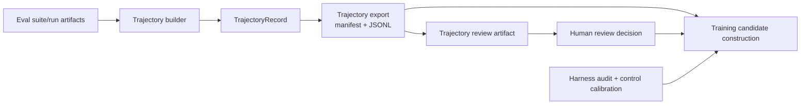

# Trajectory evidence flow

This package converts persisted eval artifacts into immutable trajectory records
and supports human review of those records. It is the evidence boundary between
evaluation and downstream training-data decisions.

## Flow

The builder validates that attempt manifests, agent payloads, scorer payloads,
task hashes, and eval summaries agree before it constructs a record. Artifact
references are retained with content hashes so downstream consumers can verify
the exact evidence rather than trust a path alone.

## Record versus review

`TrajectoryRecord` describes what happened and where the supporting artifacts
live. It includes identity, source provenance, policy, statuses, artifact
references, leakage evidence, reward components, and reward-hack detector
results. Derived fields summarize recorded evidence; they do not authorize a
training use.

`TrajectoryReviewRecord` is a separate human decision about the trajectory. The
review can change without rewriting the trajectory evidence. Downstream
candidate construction pins both the trajectory export and the review artifact,
then applies current harness and control gates.

## Core invariants

1. One trajectory ID identifies one eval-attempt occurrence and its pinned
   evidence.
2. A trajectory record is immutable evidence. Eligibility, repair selection,
   positive-SFT boundaries, and other training-use decisions belong downstream.
3. Missing or inconsistent source payloads are evidence failures, not ordinary
   task failures. They must not be reinterpreted as negative model examples.
4. Task failure and evidence failure have different data consequences. A trusted
   failed task may still support analysis or an approved training prefix; an
   untrusted trace cannot.
5. Human review does not repair or edit the trace. It records an interpretation
   with its own status, decision, reviewer identity, and provenance.
6. Hash-pinned source manifests and payloads are revalidated when downstream
   artifacts are loaded so silent drift cannot change the meaning of an existing
   decision.

## Downstream boundary

The trajectory package stops at evidence plus trajectory-level review. The
`training/candidates/` subsystem combines that material with harness-audit and
control-calibration evidence. Optional repair and objective-specific review occur
only after a `TrainingCandidateRecord` exists.
